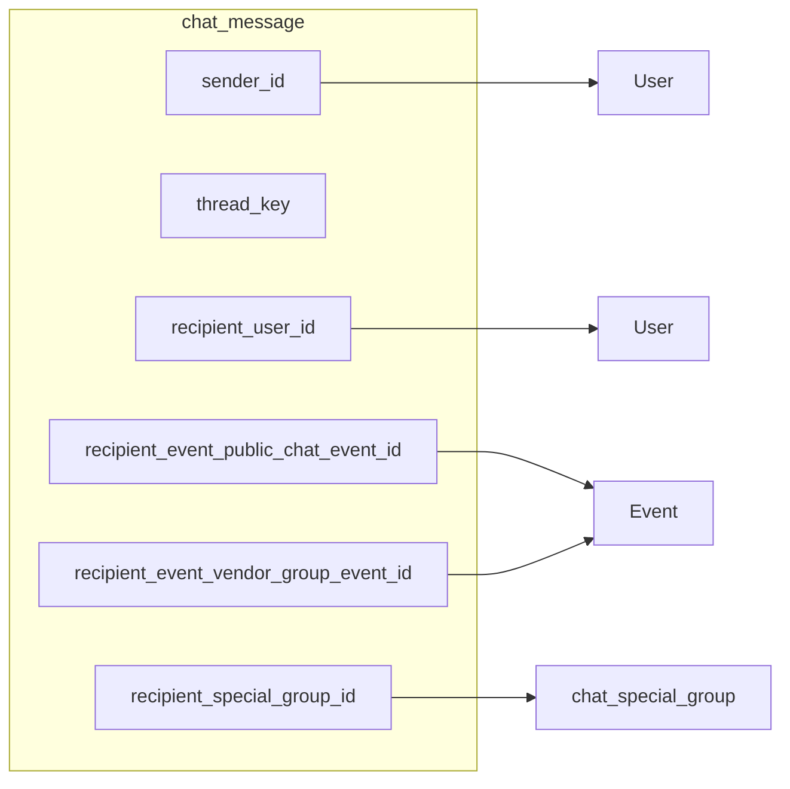

# Chat system redesign — handoff document

This document captures **product intent**, **decisions**, **rollout phases**, and **technical shape** for replacing chat with a greenfield stack. It is meant for **another engineer or AI** with no prior context.

---

## 1. Product intent (how the owner thinks about it)

- The **existing chat stack** (host–vendor messages, private conversations, direct messages, inbox aggregation, `ChatDrawerContext`, etc.) is **end-of-life**. The replacement is **clean-slate** backend APIs + **new frontend routes and components**.
- **Legacy chat will not keep working** once the cutover happens: **delete** legacy backend endpoints/models usage and **delete or stop wiring** legacy frontend chat flows. **The frontend is allowed to break** anywhere it still depended on old APIs until the new `/allnewchats` experience is wired.
- **Direct vs “friend”** remains a **UI/serializer** concern: not a separate DB channel for user–user (see backend model).
- Backend **authorization / validation** for this written plan remain **deferred** unless a later pass adds them.

---

## 2. Locked decisions (summary)

| Topic | Decision |
| ----- | -------- |
| Legacy stack | **Remove, do not maintain.** Delete legacy chat **APIs** (host-vendor messages, direct messages, private conversation messages, conversation inbox built on old tables, etc.) and **frontend** callers (`useHostVendorMessages`, `useDirectMessages`, old `ChatsPage` / `GlobalChatDrawer` / `ChatThreadPanel` integration, etc.). Expect breakage until the new UI ships. |
| Legacy data | **No migration** of old rows into the new schema in phase 1. Old DB tables may remain empty or be dropped in a separate cleanup—product call. |
| New frontend surface | **New route prefix `/allnewchats`** with **new** list page and **new** drawer—**do not** evolve old `ChatsPage` / `ChatDrawer` in phase 1. |
| Thread presentation | **Drawer only.** The message thread (list + composer) always lives **inside** the new drawer. If a “full page” route exists someday, it is only a **shell** that navigates or mounts the **same** drawer behavior—**no separate full-page thread layout.** |
| Backend model | Single `chat_message` + `thread_key`; four `recipient_*` FKs; optional special-group tables (see §3). |
| Channel typing in DB | **No `channel_kind`.** Inferred from which `recipient_*` is set. |
| User-user “direct” vs “friend” | **Same storage.** Serializer / UI use **`Friendship`** (or buddy model) for labels. |
| `thread_key` | Required on every message row; namespaced strings (`user:…`, `event_public:…`, `event_vendor:…`, `special_group:…`). **Not** SQL-`UNIQUE` on the message table (many rows per thread). |
| Special group (FE) | **Still out of scope** on the frontend until explicitly scheduled—no `special_group:*` UI in phase 1. |

---

## 3. Rollout phases (frontend + backend)

### Phase 1 — **Super basic (ship first)**

**Goal:** Prove the loop: **conversations list → open thread → read/send messages → URL + drawer behavior.**

| Deliverable | Detail |
| ----------- | ------ |
| **New routes** | **`/allnewchats`** — conversations list (new page). **`/allnewchats/t/:threadKeyEncoded`** (or equivalent; encode/decode must round-trip to backend `thread_key`) — URL causes the **new chat drawer** to open with that `thread_key`. **Back / close** updates the URL (e.g. strip `/t/...` or navigate to `/allnewchats`). **No standalone full-page thread route** in phase 1. |
| **New components** | **New list page** (not `ChatsPage.tsx`). **New drawer** (not `ChatDrawer.tsx`)—URL-driven; contains **one** minimal **thread view** (messages + composer). There is no second thread layout for “full screen.” |
| **APIs** | `GET /api/v1/chat/conversations/`, `GET /api/v1/chat/messages/?thread_key=…`, `POST /api/v1/chat/messages/` (shapes per backend). |
| **UI quality** | **Intentionally plain**—no scrapbook styling, no parity with old chat chrome. |

**Explicitly not in phase 1:** “In-between” / activity rows (see §5). Special-group UX. Porting old `ChatsPage` / `ChatThreadPanel` look-and-feel.

### Phase 2 — **In-between (activity) messages**

**Goal:** Interleave **non-chat** timeline rows with real messages (same idea as today’s `buildChatTimeline` + `ChatActivityRow`), backed by a **separate API** or server-computed payload so the **messages API stays only persisted chat lines**.

See **§5** for the **full catalog** of legacy in-between types and **data sources**.

### Phase 3 — **Polish / port old UI**

**Goal:** Bring visual and UX quality from legacy **[`ChatsPage.tsx`](frontend/src/pages/chats/ChatsPage.tsx)** and **[`ChatThreadPanel.tsx`](frontend/src/pages/chats/components/ChatThreadPanel.tsx)** (avatars, headers, badges, gradients, buddy strip, etc.) **into** the new `/allnewchats` routes and new components—**after** phase 1 and 2 are stable.

---

## 4. Backend — data model

### 4.1 `chat_special_group` + members

| Table | Purpose |
| ----- | ------- |
| `chat_special_group` | Ad hoc multi-person thread container (`id`, optional `name`, `created_by_id`, `created_at`). |
| `chat_special_group_member` | Membership (`group_id`, `user_id`, `joined_at`); **unique** `(group_id, user_id)`. |

*(No frontend for special groups in phase 1.)*

### 4.2 `chat_message`

| Column | Notes |
| ------ | ----- |
| `id` | PK |
| `sender_id` | FK → user, always set |
| `recipient_user_id` | Nullable; **user–user** |
| `recipient_event_public_chat_event_id` | Nullable; **event public / live** |
| `recipient_event_vendor_group_event_id` | Nullable; **host + vendor** |
| `recipient_special_group_id` | Nullable; **special group** |
| `body` | Text |
| `created_at` | Auto |
| `thread_key` | **Required**; canonical formats below |

**Canonical `thread_key`**

| Shape | Format |
| ----- | ------ |
| User–user | `user:{min_user_id}:{max_user_id}` |
| Event public | `event_public:{event_id}` |
| Event vendor | `event_vendor:{event_id}` |
| Special group | `special_group:{group_id}` |

**Indexes:** `(thread_key, created_at DESC)` primary; optional indexes on `recipient_*`.

---

## 5. Phase 2 — In-between messages (spec)

Today these are **not** from the messages API. They are built in **[`buildUserChatActivities`](frontend/src/features/events/chatTimeline.ts)** from several hooks, then merged in **[`buildChatTimeline`](frontend/src/features/events/chatTimeline.ts)** with real messages by **`occurredAt`**.

**Direction for phase 2:** Treat them as a **separate concern**:

- **Option A:** `GET /api/v1/chat/thread-insights/?thread_key=…` (or `peer_username=…` for user–user) returns `{ id, type, occurred_at, label, event_id?, event_title?, … }[]`—frontend merges + sorts like `buildChatTimeline`.
- **Option B:** Keep deriving on the client from existing friendship/network/overview endpoints—duplicates logic; prefer **Option A** long term.

**Catalog — all legacy “in-between” kinds and where they came from**

| # | User-visible label (pattern) | Source today | Origin data |
| - | ----------------------------- | ------------ | ------------- |
| 1 | “Became friends” | `buildUserChatActivities` | `FriendshipItem`: `accepted_at` or `created_at` |
| 2 | “Met at {event title}” (link to event) | same | `friendship.met_at_event`, `met_at_event_title`; time from `eventOverviewRows[event].event_details.start_time` or friendship dates |
| 3 | “Went to {event} together” | same | `networkPeople.went_to_events_with` row for **target** user: `event_id`, `event_title`; time from `eventOverviewRows` start_time |
| 4 | “You hosted {target}” | same | Same past-event row when **current user** is host (`eventOverviewRows.host_user_id === currentUserId`) |
| 5 | “{target} hosted you” | same | Same row when **target** is host |
| 6 | “Going to {event} together” | same | `networkActivity` filtered to target, `kind === 'going'`, `happened_at` |
| 7 | “{target} hosted you” (from activity) | same | `networkActivity` `kind === 'hosting'`, host is target |
| 8 | “You hosted {target}” (from activity) | same | `networkActivity` `kind === 'hosting'`, current user is host |
| 9 | “{target} is servicing {event}” | same | `networkActivity` `kind === 'servicing'` |

**Notes**

- **Group / event host–vendor threads** in legacy use **messages only**—no activity merge in `ChatThreadPanel` for `mode === 'group'`. Phase 2 can scope **user–user threads first** if desired.
- Deduplication today uses stable string ids (`friends-{id}`, `went-{eventId}`, etc.)—preserve that idea in API payloads.
- Sorting: merge with messages on **`occurred_at`**; on equal timestamps, legacy sorts **activity** before **message** (`buildChatTimeline`).

---

## 6. Backend — APIs (suggested)

Prefix: `/api/v1/chat/`.

| Method | Path | Role |
| ------ | ---- | ---- |
| POST | `/messages/` | Create message + `thread_key` |
| GET | `/messages/` | List by `thread_key` |
| GET | `/conversations/` | Inbox by `thread_key` + last message + enrichment |
| (Phase 2) | `/thread-insights/` or similar | In-between rows for a thread / peer |
| POST | `/groups/` | Special group (when needed) |
| POST/DELETE | `/groups/{id}/members/` | Membership |

---

## 7. Legacy deletion checklist (non-exhaustive — grep and remove)

**Backend (delete or stop registering):** routes such as `host-vendor-messages`, `direct-messages`, `conversations/…` messages, old inbox listers tied to `EventHostVendorMessage` / `EventPrivateConversation` (see [`backend/api/v1/events/urls.py`](backend/api/v1/events/urls.py)) and related views/serializers when the new app is authoritative.

**Frontend:** remove or orphan hooks and API clients used only for old chat; remove **`GlobalChatDrawer` / `openChat`** usage from flows that are replaced by **`/allnewchats`**; old **[`ChatsPage.tsx`](frontend/src/pages/chats/ChatsPage.tsx)**, **[`ChatDrawer.tsx`](frontend/src/pages/events/components/ChatDrawer.tsx)**, **[`ChatThreadPanel.tsx`](frontend/src/pages/chats/components/ChatThreadPanel.tsx)** are **not** phase-1 targets—they are **legacy** to delete or leave unused after cutover (phase 3 may **borrow** UI patterns only).

---

## 8. Phase 1 — routes & files to add (suggested)

| Piece | Suggestion |
| ----- | ---------- |
| List route | `/allnewchats` → e.g. `AllNewChatsPage.tsx` |
| Thread + drawer route | `/allnewchats/t/:threadKeyEncoded` → layout that renders list + **`AllNewChatDrawer`** with decoded `thread_key` |
| Optional full-page thread | `/allnewchats/thread/:threadKeyEncoded` if you want a non-drawer full page for testing |
| Register | [`routes.config.ts`](frontend/src/routes/routes.config.ts), [`AppRoutes.tsx`](frontend/src/routes/AppRoutes.tsx) |

New API client module under e.g. `frontend/src/features/chat/` (name as you prefer).

---

## 9. Questions for the next implementer

- Exact child path (`/allnewchats/t/...` vs query `?thread=`).
- Whether phase 1 uses **drawer-over-list** only or also a **standalone thread page**.
- When to add **auth** on new endpoints.

**Resolved:** Thread UX is **drawer-only**; any future “full page” reuses that drawer, not a parallel thread layout.

---

## 10. File index

| Role | Path |
| ---- | ---- |
| **Legacy** list (replace, not extend in phase 1) | [`frontend/src/pages/chats/ChatsPage.tsx`](frontend/src/pages/chats/ChatsPage.tsx) |
| **Legacy** drawer | [`frontend/src/pages/events/components/ChatDrawer.tsx`](frontend/src/pages/events/components/ChatDrawer.tsx) |
| **Legacy** thread / timeline | [`frontend/src/pages/chats/components/ChatThreadPanel.tsx`](frontend/src/pages/chats/components/ChatThreadPanel.tsx), [`frontend/src/features/events/chatTimeline.ts`](frontend/src/features/events/chatTimeline.ts) |
| Routes | [`frontend/src/routes/routes.config.ts`](frontend/src/routes/routes.config.ts), [`frontend/src/routes/AppRoutes.tsx`](frontend/src/routes/AppRoutes.tsx) |
| Legacy backend URLs | [`backend/api/v1/events/urls.py`](backend/api/v1/events/urls.py) |
| **Phase 1** | **New files** under e.g. `frontend/src/pages/all-new-chats/` (or similar) + feature API folder |

---

*Aligned with Cursor plan `chat_backend_redesign_d92e3a41.plan.md` for backend shape; this doc is the source of truth for **phasing**, **legacy removal**, and **`/allnewchats`**.*
