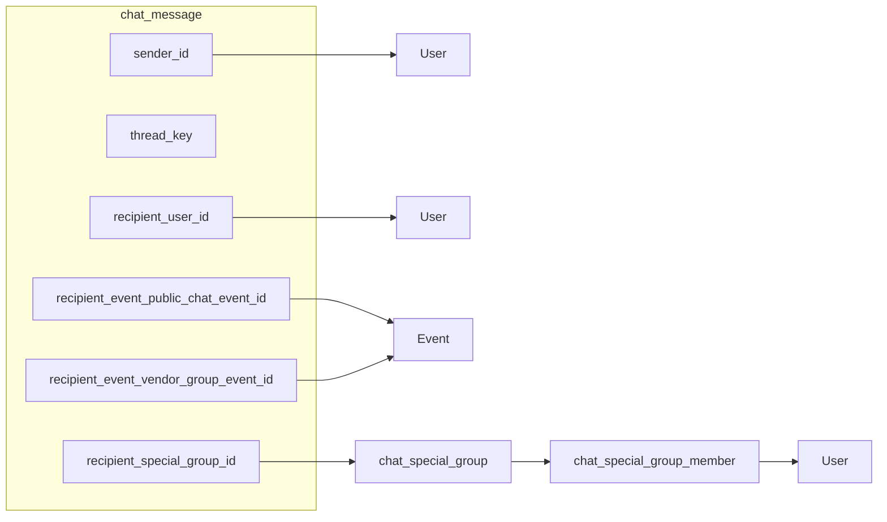

# Chat system redesign — handoff document

This document captures **product intent**, **decisions**, and **technical shape** for replacing the current fragmented chat backend and wiring a URL-driven inbox + drawer on the frontend. It is meant to be given to **another engineer or AI** with no prior context.

---

## 1. Product intent (how the owner thinks about it)

- The **existing chat stack** (separate host–vendor messages, private conversations, direct messages, multiple tables and endpoints) is considered **the wrong shape** for the long term. The goal is a **clean-slate backend design** with **one primary messages table** and **new APIs**, not a careful migration of old rows in the first phase.
- **Frontend** should feel simple: **one Chats experience** that lists conversations by recency, and **one thread = one URL**, so links, refresh, and back button behave predictably. Opening that URL should show the **chat drawer** (not only imperative “open drawer” calls).
- **Direct vs “friend” chat** is a **UI/serializer concern**: the database does **not** store two different channel types for user-to-user. Whether the UI shows “friend” styling is based on **friendship data**, not a `channel_kind` column.
- **Event live / public chat** was discussed in terms of **who can send** (product/frontend checks were mentioned earlier in discovery); the **current written plan defers all authorization and validation** on the backend for this phase—implementers should not assume server-side rules exist yet unless added later.

---

## 2. Locked decisions (summary)

| Topic | Decision |
| ----- | -------- |
| Legacy data | **Do not migrate** old `EventHostVendorMessage` / `EventPrivateConversation` / etc. into the new schema in this phase. Old code can coexist until the new stack ships. |
| Backend auth / validation | **Out of scope for this phase**—no permission matrix, no “exactly one recipient” enforcement, no request validation requirements in the written plan. |
| Channel typing in DB | **No `channel_kind` column.** The kind of thread is **inferred** from which nullable `recipient_*` foreign key is set. |
| User-user “direct” vs “friend” | **Same storage.** Serializer adds read-only fields (e.g. `peer_is_friend`) using **`Friendship`** (or buddy model). |
| Thread identity | Every message row has a required **`thread_key`** string, **namespaced** so threads never collide (e.g. `user:1:2`, `event_public:5`, `event_vendor:5`, `special_group:9`). |
| `thread_key` vs SQL UNIQUE | **Many rows share one `thread_key`.** Do **not** put `UNIQUE` on `chat_message.thread_key`. Uniqueness is **logical** (one string per thread), not one row per thread. |
| Column naming | All receiver FKs use a **`recipient_` prefix** (e.g. `recipient_event_public_chat_event_id`, not a bare `event_id` on the message). |
| Frontend routing | **Chats page** lists conversations ordered by **last message**; each row navigates to a **dedicated URL**; that route **opens [`ChatDrawer`](frontend/src/pages/events/components/ChatDrawer.tsx)** (URL-driven, sync with browser back). |
| Frontend files in scope | **[`ChatsPage.tsx`](frontend/src/pages/chats/ChatsPage.tsx)** and **[`ChatDrawer.tsx`](frontend/src/pages/events/components/ChatDrawer.tsx)** are the explicit touchpoints for this slice. |
| Special group chats | **In the backend data model** (`chat_special_group`, members, `recipient_special_group_id`). **Out of scope on the frontend for now**—no special-group creation, list, or thread UI in this phase. |
| Related frontend work | [`ChatThreadPanel`](frontend/src/pages/chats/components/ChatThreadPanel.tsx), [`ChatDrawerContext`](frontend/src/features/events/ChatDrawerContext.tsx), [`App.tsx`](frontend/src/App.tsx) (`GlobalChatDrawer`), [`routes.config.ts`](frontend/src/routes/routes.config.ts), [`AppRoutes.tsx`](frontend/src/routes/AppRoutes.tsx) will likely need updates to support `thread_key` + routing. |

---

## 3. Backend — data model

### 3.1 `chat_special_group` + members

| Table | Purpose |
| ----- | ------- |
| `chat_special_group` | Ad hoc multi-person thread container (`id`, optional `name`, `created_by_id`, `created_at`). |
| `chat_special_group_member` | Membership (`group_id`, `user_id`, `joined_at`); **unique** `(group_id, user_id)`. |

*(Frontend does not build flows for this yet; backend may still define tables for future use.)*

### 3.2 `chat_message` (single messages table)

| Column | Notes |
| ------ | ----- |
| `id` | PK |
| `sender_id` | FK → user, always set |
| `recipient_user_id` | Nullable; set for **user–user** only |
| `recipient_event_public_chat_event_id` | Nullable; **event public / live** channel |
| `recipient_event_vendor_group_event_id` | Nullable; **host + vendor** group for that event |
| `recipient_special_group_id` | Nullable; **special group** thread |
| `body` | Text |
| `created_at` | Auto |
| `thread_key` | **Required** on every row; canonical formats below |

**Design intent:** exactly **one** of the four `recipient_*` columns is non-null per row (plus `sender_id`). The plan does **not** require DB `CHECK` or app validation in this phase—still the intended invariant.

**Canonical `thread_key` values**

| Shape | `thread_key` format |
| ----- | ------------------- |
| User–user | `user:{min_user_id}:{max_user_id}` |
| Event public | `event_public:{event_id}` |
| Event vendor | `event_vendor:{event_id}` |
| Special group | `special_group:{group_id}` |

**Indexes (recommended)**

- `(thread_key, created_at DESC)` — inbox + thread history
- Optional extra indexes on `recipient_*` if useful for admin or joins

### 3.3 Mermaid (entity sketch)

---

## 4. Backend — APIs (suggested)

Prefix: `/api/v1/chat/` (auth classes not specified in this plan).

| Method | Path | Role |
| ------ | ---- | ---- |
| POST | `/messages/` | Create message; set one `recipient_*` + `thread_key` |
| GET | `/messages/` | List messages for a `thread_key` (pagination) |
| GET | `/conversations/` | Inbox: distinct threads + last message preview + enrichment; user–user rows include serializer friendship fields |
| POST | `/groups/` | (Future / parallel) create special group |
| POST/DELETE | `/groups/{id}/members/` | (Future / parallel) membership |

**Inbox:** aggregate with `GROUP BY thread_key`; last message = max `created_at` per key.

---

## 5. Backend — implementation order

1. Django app (e.g. `apps/chat`): models above + index on `(thread_key, created_at)`; `save()` sets `thread_key` from whichever `recipient_*` is written.
2. Serializers + friendship prefetch for user–user presentation fields.
3. Services: inbox query + thread history filter.
4. Views/URLs for POST/GET messages and GET conversations.
5. Optional smoke tests.

---

## 6. Frontend plan

### 6.1 Goals

1. **One URL per thread** — Encode `thread_key` safely (e.g. `encodeURIComponent(thread_key)` or base64url). Example routes: `/chats` (inbox) and `/chats/t/<encodedThreadKey>` (thread open). Must decode back to the exact backend `thread_key`.

2. **Chats page** — [`ChatsPage.tsx`](frontend/src/pages/chats/ChatsPage.tsx) loads **`GET /conversations/`** (new API), sorts by **last message time**, renders rows that **navigate** to the thread URL on click.

3. **Drawer from URL** — When the thread route is active, show [`ChatDrawer.tsx`](frontend/src/pages/events/components/ChatDrawer.tsx) **driven by the route** (deep link + refresh). Closing the drawer updates history (e.g. navigate to `/chats` or `navigate(-1)`).

### 6.2 Integration notes

- Today [`ChatDrawerProvider`](frontend/src/features/events/ChatDrawerContext.tsx) + [`GlobalChatDrawer`](frontend/src/App.tsx) use **imperative** `openChat`. Move toward **router-first** or **sync route ↔ context** so list clicks, direct URLs, and back stay consistent.
- [`ChatThreadPanel`](frontend/src/pages/chats/components/ChatThreadPanel.tsx) should read/write the **new** APIs using **`thread_key`** (and whatever POST body the backend defines).
- Register routes in [`routes.config.ts`](frontend/src/routes/routes.config.ts) / [`AppRoutes.tsx`](frontend/src/routes/AppRoutes.tsx).

### 6.3 In scope vs out of scope (frontend)

| In scope | Out of scope (this phase) |
| -------- | ------------------------- |
| [`ChatsPage.tsx`](frontend/src/pages/chats/ChatsPage.tsx) — list + navigate | **Special group chats** — no UI for create, manage, or open `special_group:*` threads |
| [`ChatDrawer.tsx`](frontend/src/pages/events/components/ChatDrawer.tsx) — URL-opened drawer | Special-group **backend** endpoints can exist; **do not** prioritize consumer UI |
| Per-thread URL + history sync | Embedding public/vendor threads on event detail pages (unless you explicitly add later) |
| Wiring `ChatThreadPanel` to new APIs | Realtime (WS/SSE) unless added later |

---

## 7. Questions for the next implementer

**No blocking questions** are left from the planning conversation; the owner signed off with “perfect” on the URL + drawer approach.

**Optional follow-ups** (if product changes):

- Exact path prefix for chats (`/chats` vs nested under another layout).
- Whether `thread_key` in the URL should be encoded only for user–user threads or always.
- When to turn **authorization / validation** back on for the backend.

---

## 8. File index (quick reference)

| Area | Path |
| ---- | ---- |
| Chats list (in scope) | [`frontend/src/pages/chats/ChatsPage.tsx`](frontend/src/pages/chats/ChatsPage.tsx) |
| Drawer shell (in scope) | [`frontend/src/pages/events/components/ChatDrawer.tsx`](frontend/src/pages/events/components/ChatDrawer.tsx) |
| Thread UI | [`frontend/src/pages/chats/components/ChatThreadPanel.tsx`](frontend/src/pages/chats/components/ChatThreadPanel.tsx) |
| Drawer context | [`frontend/src/features/events/ChatDrawerContext.tsx`](frontend/src/features/events/ChatDrawerContext.tsx) |
| Global drawer mount | [`frontend/src/App.tsx`](frontend/src/App.tsx) |
| Routes | [`frontend/src/routes/routes.config.ts`](frontend/src/routes/routes.config.ts), [`frontend/src/routes/AppRoutes.tsx`](frontend/src/routes/AppRoutes.tsx) |
| Legacy chat APIs (to be replaced over time) | [`backend/api/v1/events/urls.py`](backend/api/v1/events/urls.py) (host-vendor, direct, conversations) |

---

*Document generated from the chat redesign planning thread. Backend §1–6 and frontend §6 align with the Cursor plan `chat_backend_redesign_d92e3a41.plan.md`.*
